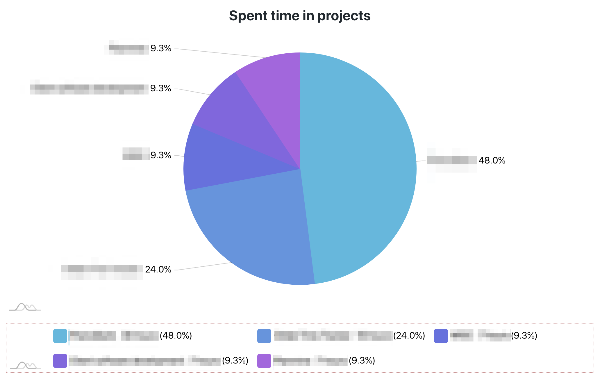
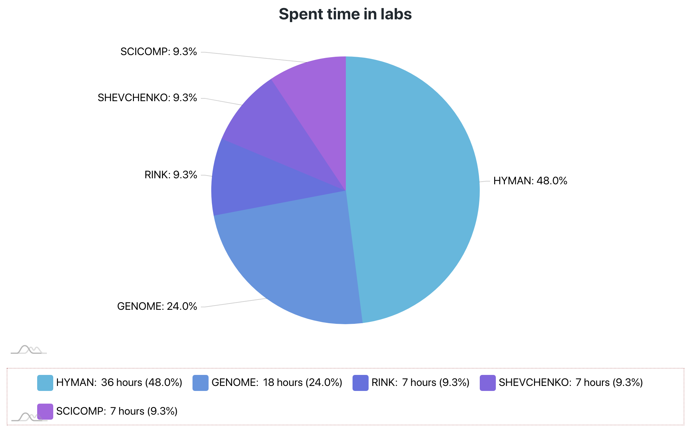
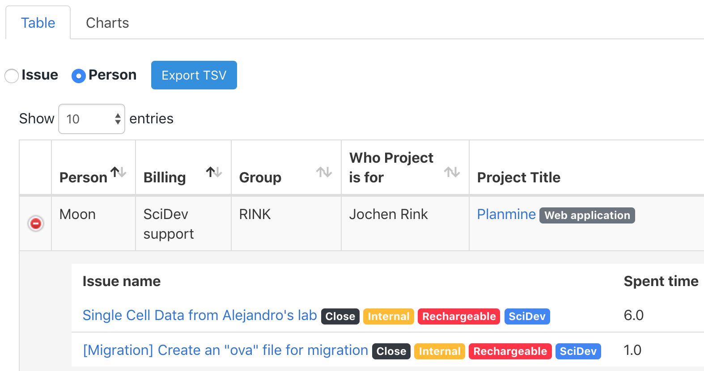
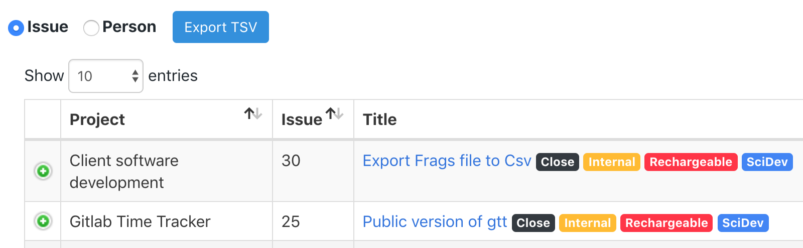

# gtt
Gitlab Time Tracker App provides overview of how your team spent time resources.


## Gitlab Time Tracker User Interface
This application gives an overview of team spent times on specific projects and groups.

## How to organize the issues with labs
Each project has ```topics``` attribute in the gitlab project setting where we add relevant keywords. ```gtt``` parses the specific form of string, ```title: Gitlab Time Tracker, contact: HongKee Moon, group: SCICOMP``` where it accumulate times along with ```title``` and ```group``` for the project management purpose even though other uses spent their time. ```contact``` information is used for specifying who project is for. Those information is visualized in ```Spent time in projects``` and ```Spent time in labs``` pie charts.





## Preference

### User Groups
This information is used for billing category in ```Person``` based data table view.


### Tag Colors
This json information is used to select colors for tags in ```Issue``` based data table view.

